# Diagramme de classes

Diagramme simplifié des classes principales du projet (les méthodes listées
sont les plus significatives ; la persistance est isolée dans les
repositories).

## Diagramme (Mermaid)

```mermaid
classDiagram
    direction TB

    %% --- Couche Web / Front Controller ---
    class Application {
        <<front controller>>
        -Dispatcher routeur
        -ContainerInterface conteneur
        -View vue
        +run(): void
    }

    class SalleController {
        -SalleRepositoryInterface salles
        -SalleValidator validateur
        -View vue
        +index(): string
        +show(int id): string
        +create(): string
        +store(): string
        +edit(int id): string
        +update(int id): string
    }

    class ReservationController {
        -ReservationRepositoryInterface reservations
        -SalleRepositoryInterface salles
        -ReservationValidator validateur
        -CreerReservationService creerReservation
        -AnnulerReservationService annulerReservation
        -View vue
        +index(): string
        +show(int id): string
        +create(): string
        +store(): string
        +cancel(int id): string
    }

    class AccueilController {
        -SalleRepositoryInterface salles
        -ReservationRepositoryInterface reservations
        -View vue
        +index(): string
    }

    %% --- Couche Service ---
    class CreerReservationService {
        -SalleRepositoryInterface salles
        -ReservationRepositoryInterface reservations
        +executer(CreerReservationDTO dto): Reservation
    }

    class AnnulerReservationService {
        -ReservationRepositoryInterface reservations
        +executer(int reservationId): void
    }

    %% --- Couche Repository ---
    class SalleRepositoryInterface {
        <<interface>>
        +lister(): array
        +trouverParId(int id): ?Salle
        +enregistrer(CreerSalleDTO dto): Salle
        +mettreAJour(Salle salle): Salle
    }

    class ReservationRepositoryInterface {
        <<interface>>
        +lister(): array
        +listerParSalle(int salleId): array
        +trouverParId(int id): ?Reservation
        +trouverChevauchement(int salleId, DateTimeImmutable debut, DateTimeImmutable fin): ?Reservation
        +enregistrer(CreerReservationDTO dto): Reservation
        +annuler(Reservation reservation): Reservation
    }

    class EloquentSalleRepository {
        +lister(): array
        +trouverParId(int id): ?Salle
        +enregistrer(CreerSalleDTO dto): Salle
        +mettreAJour(Salle salle): Salle
    }

    class EloquentReservationRepository {
        +lister(): array
        +listerParSalle(int salleId): array
        +trouverParId(int id): ?Reservation
        +trouverChevauchement(int salleId, DateTimeImmutable debut, DateTimeImmutable fin): ?Reservation
        +enregistrer(CreerReservationDTO dto): Reservation
        +annuler(Reservation reservation): Reservation
    }

    %% --- Couche Domaine ---
    class Salle {
        +nom: string
        +batiment: string
        +capacite: int
        +type: string
        +active: bool
        +reservations(): HasMany
    }

    class Reservation {
        +salle_id: int
        +responsable: string
        +email: string
        +motif: string
        +date_debut: datetime
        +date_fin: datetime
        +statut: string
        +salle(): BelongsTo
    }

    %% --- DTO ---
    class CreerSalleDTO {
        +string nom
        +string batiment
        +int capacite
        +string type
        +bool active
    }

    class CreerReservationDTO {
        +int salleId
        +string responsable
        +string email
        +string motif
        +DateTimeImmutable dateDebut
        +DateTimeImmutable dateFin
    }

    %% --- Validation ---
    class ValidatorInterface {
        <<interface>>
        +validate(array data): ValidationResult
    }

    class ValidationResult {
        +isValid(): bool
        +errors(): array
        +getDonnees(): array
    }

    class SalleValidator
    class ReservationValidator

    %% --- Vues / Moteur ---
    class View {
        -string cheminBase
        +rendu(string template, array donnees, ?string gabarit): string
    }

    %% --- Relations ---
    SalleController --> SalleRepositoryInterface
    SalleController --> SalleValidator
    SalleController --> View
    ReservationController --> ReservationRepositoryInterface
    ReservationController --> SalleRepositoryInterface
    ReservationController --> ReservationValidator
    ReservationController --> CreerReservationService
    ReservationController --> AnnulerReservationService
    AccueilController --> SalleRepositoryInterface
    AccueilController --> ReservationRepositoryInterface
    Application --> Dispatcher
    Application --> View

    CreerReservationService --> SalleRepositoryInterface
    CreerReservationService --> ReservationRepositoryInterface
    AnnulerReservationService --> ReservationRepositoryInterface

    EloquentSalleRepository ..|> SalleRepositoryInterface
    EloquentReservationRepository ..|> ReservationRepositoryInterface

    SalleValidator ..|> ValidatorInterface
    ReservationValidator ..|> ValidatorInterface
    SalleValidator --> ValidationResult
    ReservationValidator --> ValidationResult

    Salle "1" --> "0..*" Reservation : possède
    Reservation "*" --> "1" Salle : appartient

    EloquentSalleRepository --> Salle
    EloquentReservationRepository --> Reservation
    CreerReservationService ..> CreerReservationDTO : reçoit
    SalleController ..> CreerSalleDTO : construit
    ReservationController ..> CreerReservationDTO : construit
```



## Schéma relationnel

```
salles(id PK, nom, batiment, capacite, type, active, created_at, updated_at)

reservations(id PK, salle_id FK->salles.id, responsable, email, motif,
             date_debut, date_fin, statut, created_at, updated_at)
```

## Conventions

- Les contraintes imposées par l'énoncé : `SalleController` /
  `ReservationController` ne font **aucune** requête ORM ; les services ne
  connaissent ni `$_POST`, ni FastRoute, ni les vues, ni le conteneur ; seuls
  `public/index.php` et `Application` accèdent directement au conteneur.